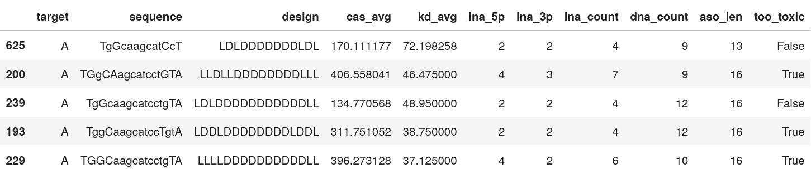

## Antisense therapy

Since the advent of the human genome project, we have advanced rapidly in sequencing technology. One big advantage to this is that we have been able to identify the genetic roots of several diseases such as cancer, Parkinson's, rheumatoid arthritis, and Alzheimer's. This knowledge has been thoroughly applied to diagnostic use. However, its full potential has not been realised to treating these diseases.

How wonderful would it be to target these specific genetic defects with personalized medicine?

Recently, RNA- and DNA-based drugs have shown great promise of treating diseases at the genetic level. One specific type of drug is chemically engineered oligonucleotides that are complementary to a specific messenger RNA (mRNA). They bind to the mRNA through standard base-pairing which stops the translation of the target protein. These short, synthetic, single-stranded nucleic acids are called antisense oligonucleotides (ASOs).


[*The Conversation* - Antisense therapy: a promising new way to treat neurological disease](https://theconversation.com/antisense-therapy-a-promising-new-way-to-treat-neurological-disease-89006)

```
- DNA/RNA is not converted, it is transcribed
- gapmers are RNase H recruiting, an enzyme that cleaves the site that the gapmer attached to.
```

This introduction relied heavily on [*Antisense Therapy: An Overview* by Shashwat Sharad](https://www.intechopen.com/books/antisense-therapy/antisense-therapy-an-overview).

## Locked Nucleic Acids (LNA)

If we simply produce a short strand of DNA or RNA complementary to the specific mRNA we run into some limitations:

* it will be unstable, i.e. likely to degrade;
* it has a poor binding affinity making it bad at attaching to the target site.

Therefore the oligonucleotides need synthetic modifications to overcome these limitations. One example is locked nucleic acids (LNA). These are modifications to the sugar ring that make up the nucleotide. LNA modifications are intended to increase the resistance of the ASO to degradation. LNA also has a big effect on the binding energy of the ASO, increasing the likelihood that it will attach to the target site on the mRNA.

For more information on LNA, you can begin by checking [*Locked nucleic acid as a novel class of therapeutic agents* by R. N. Veedu and J. Wengel](https://doi.org/10.4161/rna.6.3.8807).

## LNA Gapmers

How to make use of LNA, then? A synthesized oligonucleotide will be flanked by LNA molecules, which not only will protect it from enzymes, but also help it attach to the targeted mRNA sequence. These are called LNA gapmers and the gap refers to the unmodified oligonucleotide between the LNA flanks.

The ASOs we will be discussing in this blogpost are LNA gapmers. Here they will be represented as strings of nucleobases with the following convention: LNA-modified bases will be written in uppercase, while unmodified bases will be written in lowercase. Below is an example of an LNA gapmer:

<big> ```TGGCaagcatccTGTA``` </big>

Here `TGGC` and `TGTA` are the LNA-modified flanks and `aagcatcc` is the 'gap' between the flanks with standard DNA sugars.

## Toxic side effects

Some LNA ASOs are very effective at reducing the expression of targeted proteins. However there is evidence that LNA ASOs can cause liver damage  (hepatotoxicity) - [Swayze et al](10.1093/nar/gkl1071), [Burel et al](10.1093/nar/gkv1210).

While such drugs would not be approved for clinical trials, a clear understanding of the mechanism leading to toxicity is necessary to improve the development of safe ASO drugs.

Preclinical studies have shown that levels of liver toxicity were independent of the gene inhibition caused by LNA ASOs ([Swayze et al](10.1093/nar/gkl1071)). Moreover the replacement of a single nucleotide in the LNA gapmer can have significant effects on its toxicity ([Stanton et al](https://doi.org/10.1089/nat.2012.0366)), meaning that LNA ASO design could be a major contributer to toxicity.

People have used machine learning methods to understand the relation between LNA ASO sequence structures and toxicity ([Hagedorn et al](10.1089/nat.2013.0436), [Stanton et al](https://doi.org/10.1089/nat.2012.0366), [Papargyri et al](https://doi.org/10.1016/j.omtn.2019.12.011)). In this blogpost we aim at contributing to these efforts by applying a novel method using symbolic regression: the [QLattice](https://www.abzu.ai/).

The QLattice is a symbolic regression algorithm designed to find the simplest mathematical relationship that will explain observations. One can find out more about it [here](https://docs.abzu.ai/).

In summary, the crux of this blogpost will be to try to answer the following question:

**Does LNA design contribute to toxicity and if so, how?**

## Data

In our analysis, we used the data from [Papargyri et al](https://doi.org/10.1016/j.omtn.2019.12.011). The data set contains two sets of iso-sequential LNA-modified gapmers, where the authors of the study systematically varied the number and positions of LNA modifications in the flanks.

Specifically, there are 768 different LNA gapmers, where 386 of them target a region we will call **region A**, and 386 of them target a region we will call **region B**. This means the "6-gap" is the same within each region and the only variance is in the LNA flanks. Four of the ASOs target neither of the regions and were included in the original study as inactive controls. We will not use those four ASOs in this blogpost.

> For the curious: Both region A and B are located on the hypoxia-inducible factor 1-alpha (HIF1A) mRNA. "The HIF1A protein regulates cellular responses to hypoxia, and elevated expression of HIF1A has been associated with poor prognosis for many types of cancer."

In the aforementioned study toxicity is measured by caspase activation. Caspase is a family of enzymes that play an essential role in programmed cell death.

Below are five entries of the data set.


- **target**: A or B, indicates which region in HIF1A is targeted.
- **sequence**: the sequence of the ASO. Lowercase means DNA, uppercase means LNA
- **design**: the gapmer design. Each character is either L or D for LNA or DNA.
- **cas_avg**: the average caspase activation across several measurements. Low caspase means that the ASO is safe, high caspase means that the ASO is toxic. This is a percentage of the usual baseline levels of caspase activity in a healthy cell.
- **kd_avg**: average knockdown. How potent the ASO is in reducing the targeted mRNA. It is expressed as a percentage of the mRNA remaining. A low value means a potent drug, while a value close to 100 means the mRNA wasn't knocked down by the ASO.

## Strategy

First we will use the QLattice to find a mathematical expression that will serve as a hypothesis for the relation between LNA ASO design and toxicity solely on region A. Then we will scrutinize this hypothesis by testing whether it generalises to region B.

Previous work has shown that a reasonable threshold for caspase activation is 300%. [(Deickmann et al)](https://doi.org/10.1016/j.omtn.2017.11.004).
We will use this as the cutoff value for training a QLattice classifier model: below this value the drug is seen as having low/mid levels of toxicity (negative class), while above this threshold the drug is seen as very toxic (positive class).

It should be noted that we will not be optimizing for potency (knockdown).


Since we know that the ASOs targeting each region differ only in the where the LNA modifications are, we will be generating a model that explains caspase activation from the LNA/DNA configuration only. For example, each ASO targeting region A consists of or is a subset of the following sequence

<big> ```tggcaagcatcctgta``` </big>

Here is an example of an LNA modification of the sequence above:

<big> ```TggcAagcatccTgTA``` </big>

When it comes to the feature engineering we will count only the amount of upper case (LNA) and lower case (DNA) bases in the ASO.

### Feature engineering

We will engineer four features that capture some of the LNA ASOs design.

- **lna_5p**: the number of LNA nucleobases in the *left* flank (5'). Embedded DNA bases are not counted;
- **lna_3p**: the number of LNA nucleobases in the *right* flank (3'). Embedded DNA bases are not counted;
- **lna_count**: the number of LNA nucleobases across the ASO;
- **dna_count**: the number of DNA nucleobases across the ASO;

Note that there is some redundancy here: $lna\_count = lna\_5p + lna\_3p$. We include it nonetheless to allow the QLattice to choose whether to distinguish between the 5' and the 3' end or not.

Here is the final dataset to be fed to the QLattice. Observe this is only on ASOs targeting region A.



## Why use a QLattice?

The QLattice is a quantum-inspired algorithm that explores the space of all mathematical expressions that relate the output (toxicity) to the input (ASO design characteristics). The result of the search is a list of hypotheses sorted by how well they match observations.

Caspase toxicity is a biological mechanism that is a function of many subprocesses in the cell. Working with the QLattice is an iterative process by which we want to understand how the data we have is related to these biological mechanisms. We start by engineering some simple features and by seeing how they interact we eventually come up with appropriate features to describe caspase toxicity. The output in the end is not only a predictive model that we can benchmark, but an actual explanation of the underlying biology that enables us to design less toxic compounds in the future.

In this blogpost we use the QLattice to generate classification models. Mathematically, this means that the QLattice will wrap each expression in a logistic function. This allows the output to be interpreted as a probability. In other words, if $X$ is an input vector and $Y$ is the event we want to predict, then the QLattice will search for functions $f(X)$ such that the predictive power of
$$\widehat{Y} = \frac{1}{1+e^{-f(X)}}$$
is maximised.

In our case, Y is the probability of an ASO being above the 300% toxicity cutoff value, and $f$ is *any* function of our input features. Specifically, the QLattice will be searching for the following expressions:

$$\widehat{P}(too\_toxic) = \frac{1}{1+e^{-f(lna\_5p, lna\_3p, dna\_count, lna\_count, aso\_len)}}$$

> Note that in order to use a QLattice you need get one from Abzu [here](https://abzu.ai).

## Finding hypotheses

Below is a code snippet of how to search for hypotheses with the QLattice. Here we use [Akaike information criterion](https://en.wikipedia.org/wiki/Akaike_information_criterion) (AIC) to sort the hypotheses. `dfA` is the data set of region A we train the QLattice on.

```python
import feyn

features = ["lna_5p", "lna_3p", "dna_count", "lna_count", "aso_len"]

qlattice = feyn.QLattice()
qlattice.reset(465)
qgraph = qlattice.get_classifier(features, "too_toxic", max_depth=2)

for _ in range(30):
    qgraph.fit(dfA, loss_function=feyn.losses.binary_cross_entropy, threads=7, criterion="aic")
    qlattice.update(qgraph.best())
```

## Results

Here is the best performing hypothesis (graph) according to AIC:


and this is the graph interpreted as a mathematical expression:


Note how the exponent of $e$ above is the equation of an [ellipse](https://en.wikipedia.org/wiki/Ellipse). This sets the boundary between the positive and negative classes in the two-dimensional plane of `lna_3p` and `lna_5p`. We can see this demonstrated below where the colour bar is the probability of the ASO being too toxic.


Observe how the amount of LNA modifications in the 5' flank has a stronger effect on its toxicity than the amount of modifications in the 3' flank.

Below are the ROC curves of each region with their respective AUC scores


Observe how the AUC score on region B is actually higher than on region A. This shows the hypothesis (graph) above generalises well to region B.

Lastly we plot the distributions of the predicted probability scores for each region. According to the AUC scores, region B
separates more cleanly between the classes compared to region A.


## Conclusion

We began our journey settled on tackling the question:

**Does LNA design contribute to toxicity and if so, how?**

Our hypothesis indicates that LNA design **does** contribute to toxicity. More specifically, it says that there is an elliptical boundary that separates between the positive and negative classes. High toxicity is associated with high LNA count on both flanks (`lna_5p` $\gtrsim$ 3 and `lna_3p` $\gtrsim$ 4). Furthermore, the good performance on region B added validity to the hypothesis.

To provide further tests to this hypothesis it would be interesting to perform experiments with LNA ASOs whose sequences are different from the ones in regions A and B.

Note that in our feature engineering process we didn't discriminate between positions of the LNA modifications in the flanks, we only counted them. This could be a cause to the misclassifications as some positions might contribute more than others. For further study we could investigate whether the position of the LNA modification in the flanks contributes to toxicity.
